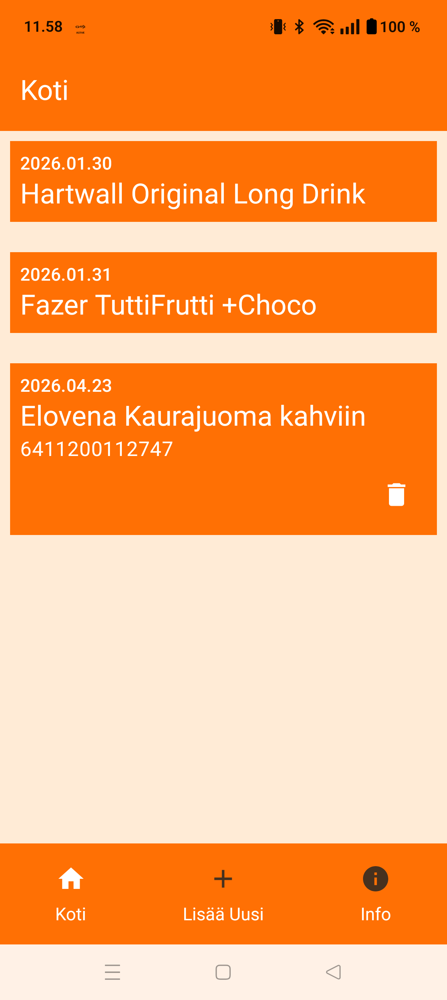
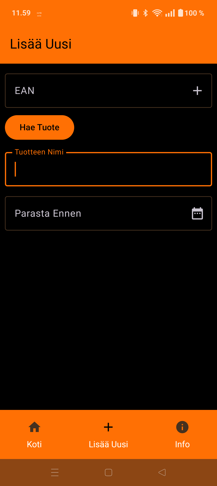

# Date Management App with Jetpack Compose

This is my extra assignment for Oulu University of Sciences Mobile Programming with Native Technologies course.

I created an app for inventory management, where you can save products and their expiration dates.

## Home Page

Home page lists all the items in order of their expiration date. Items can be expanded and then deleted from database.
Shown here in light mode:

## Add New

New items can be added on Add New -page.
User can input EAN codes using Google Code Scanner, with support for EAN 13 and EAN 8 codes.

Based on the barcode, you can fetch product name from openfoodfacts.org.

Modal datepicker is used for expiration date.
Shown here in dark mode:

RoomDatabase is used to persist data.

A little explanation video:
[https://youtu.be/UcnbRUIsOz4](https://youtu.be/UcnbRUIsOz4)
